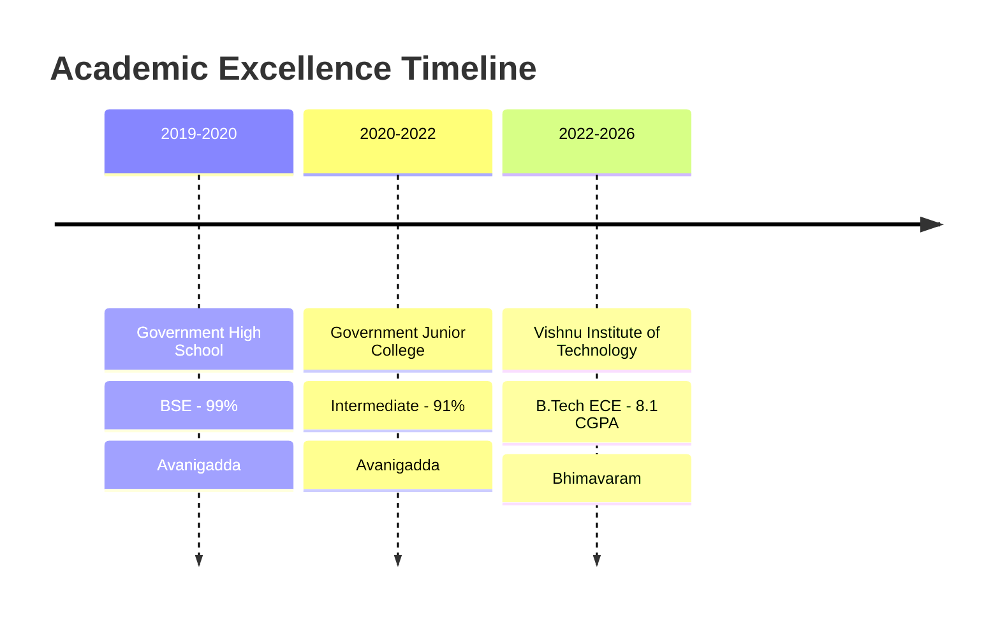

<div align="center">

<!-- Dynamic Header with Typing Animation -->


<!-- Animated Typing SVG -->
<a href="https://git.io/typing-svg"></a>

<br/>

<!-- Social Media & Contact Badges -->
<p align="center">
  <a href="https://www.linkedin.com/in/rohith-kumar-17ba492b1"></a>
  <a href="mailto:rohithkumar20056@gmail.com"></a>
  <a href="https://github.com/KarraRohithKumar"></a>
  <a href="tel:+919550903818"></a>
</p>

<br/>

<!-- Profile Views Counter -->


</div>

---

## 🎯 About Me

```javascript
const rohith = {
    location: "Bhimavaram, Andhra Pradesh, India",
    education: "B.Tech ECE @ Vishnu Institute of Technology",
    currentFocus: ["Full Stack Development", "Java Backend", "Problem Solving"],
    interests: ["Web Development", "Data Analytics", "IoT Systems"],
    lifePhilosophy: "Continuous learning and innovation drive excellence",
    currentlyLearning: ["Spring Boot", "Advanced Java", "System Design"],
    lookingFor: "Opportunities to contribute to innovative projects",
    funFact: "First Runner-Up in WAVE-VIT Competition 2024 🏆"
};
```


### 🚀 Quick Highlights

- 🎓 **ECE Engineering Student** with **8.1 CGPA** at Vishnu Institute of Technology
- 💼 **Full Stack Development Intern** at SmartBridge (APSCHE)
- 🏆 **Award Winner**: First Runner-Up at WAVE-VIT & Top 5 at TechSprout-2K25
- 📊 Built **Real-Time Weather App**, **Smart Traffic System** & **Power BI Dashboards**
- 💡 Strong foundation in **Java**, **Spring Boot**, **Web Technologies** & **Data Analysis**
- 🌱 Passionate about **Problem Solving** and **Innovation**

---

## 🛠️ Tech Arsenal

<div align="center">

### 💻 Programming & Frameworks


### 🌐 Web Technologies


### 🔧 Tools & Technologies


### 🎨 Design & Hardware


</div>

---

## 📊 GitHub Analytics

<div align="center">
  
  
</div>

<div align="center">
  
  
</div>

<!-- GitHub Trophies -->
<div align="center">
  
</div>

---

## 💼 Featured Projects

<div align="center">

<table>
<tr>
<td width="50%">

### 🌤️ Real-Time Weather App


**Responsive weather application with real-time updates**
- Integrated external APIs for live weather data
- Responsive design for seamless cross-device access
- Clean and intuitive user interface

[🔗 Live Demo](https://github.com/KarraRohithKumar) • [💻 Code](https://github.com/KarraRohithKumar)

</td>
<td width="50%">

### 🚦 Smart Traffic System


**Dynamic inter-junction traffic optimization system**
- Vehicle density-based signal adjustment
- Real-time data logging with Excel integration
- LED indicators for live signal updates

[💻 Code](https://github.com/KarraRohithKumar)

</td>
</tr>

<tr>
<td width="50%">

### 📊 Supermarket Sales Dashboard


**Comprehensive sales analytics dashboard**
- DAX measures for revenue, profit & trends
- Interactive visualizations with drill-through
- KPIs for store performance analysis

[💻 Code](https://github.com/KarraRohithKumar)

</td>
<td width="50%">

### 💻 LeetCode Solutions


**Collection of problem-solving solutions**
- Data structures and algorithms practice
- Optimized Java implementations
- Regular problem-solving practice

[💻 Code](https://github.com/KarraRohithKumar/leetcode-problems)

</td>
</tr>
</table>

</div>

---

## 🎓 Education Journey



---

## 🏆 Achievements & Certifications

<div align="center">

| 🏅 Achievement | 📅 Year | 🎯 Details |
|:---------------|:--------|:-----------|
| 🥈 **First Runner-Up** | 2024 | WAVE-VIT Competition @ VIT |
| 🏆 **Top 5 Finish** | 2025 | TechSprout-2K25 (5th/40 teams) |
| ☕ **Java Basic** | 2025 | HackerRank Certification |
| 🧩 **Problem Solving** | 2025 | HackerRank Basic Certification |
| 📊 **Data Visualization** | 2024 | Forage Job Simulation |
| 🔬 **MATLAB Basics** | 2024 | MathWorks Certification |

</div>

---

## 💼 Professional Experience

### 🌟 Full Stack Development Intern
**SmartBridge** (in collaboration with APSCHE) • *June 2025 – August 2025*

```python
internship_experience = {
    "duration": "3 months",
    "role": "Full Stack Development Intern",
    "focus_areas": [
        "Web application development",
        "Frontend & Backend integration",
        "Team collaboration",
        "Real-world project contribution"
    ],
    "achievements": [
        "Strengthened fundamentals in Full Stack Development",
        "Contributed to web application development tasks",
        "Enhanced practical development skills"
    ]
}
```

---

## 📈 Contribution Graph

<div align="center">
  
</div>

---

## 🎯 Current Focus

<div align="center">

```ascii
┌─────────────────────────────────────────────────────────────┐
│                                                             │
│  🎯 Learning Spring Boot Advanced Concepts                 │
│  🔧 Building Full Stack Applications                       │
│  💡 Exploring Microservices Architecture                   │
│  📊 Enhancing Data Analytics Skills                        │
│  🚀 Contributing to Open Source Projects                   │
│                                                             │
└─────────────────────────────────────────────────────────────┘
```

</div>

---

## 💬 Let's Connect!

<div align="center">

I'm always excited to collaborate on innovative projects and explore new opportunities!

**Available for:**
- 💼 Full-time opportunities
- 🤝 Collaboration on open-source projects
- 💡 Innovative project discussions
- 📚 Knowledge sharing and mentorship

<br/>

### 📫 Reach Out To Me

<p align="center">
  <a href="mailto:rohithkumar20056@gmail.com">
    
  </a>
  <a href="https://linkedin.com/in/rohithkumar">
    
  </a>
  <a href="tel:+919550903818">
    
  </a>
</p>

</div>

---

<div align="center">

### 💭 Quote of the Day


<br/>

### 🐍 Watch My Contribution Snake!


<br/>

---


**⭐ From [KarraRohithKumar](https://github.com/KarraRohithKumar) with 💙**

*Last Updated: January 2026*

</div>
